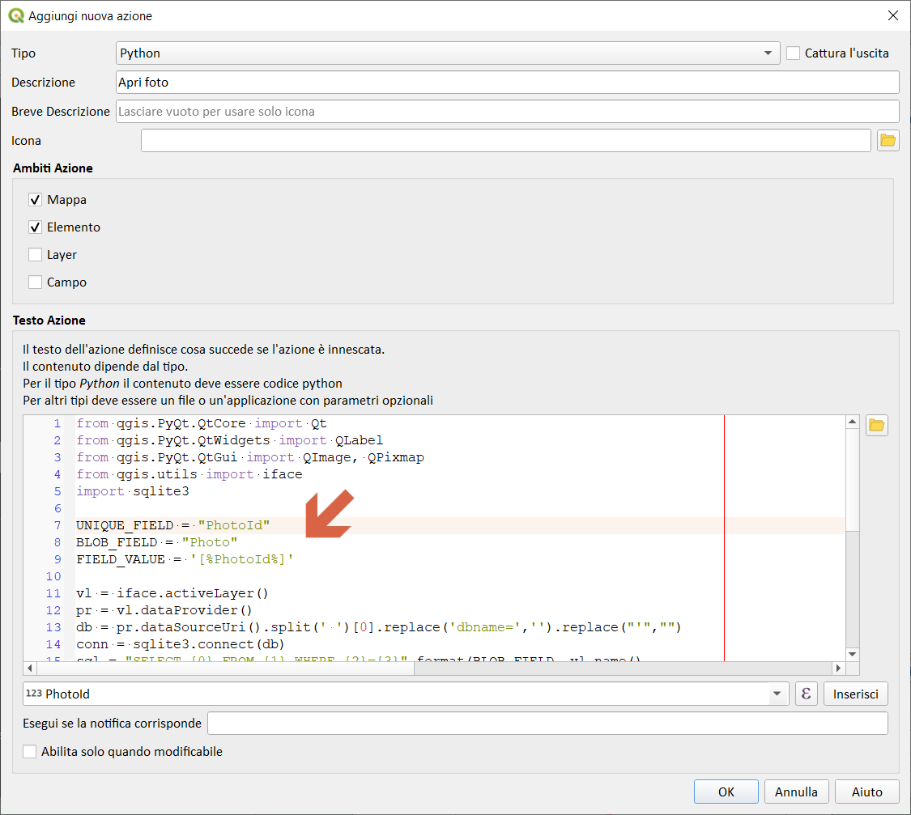
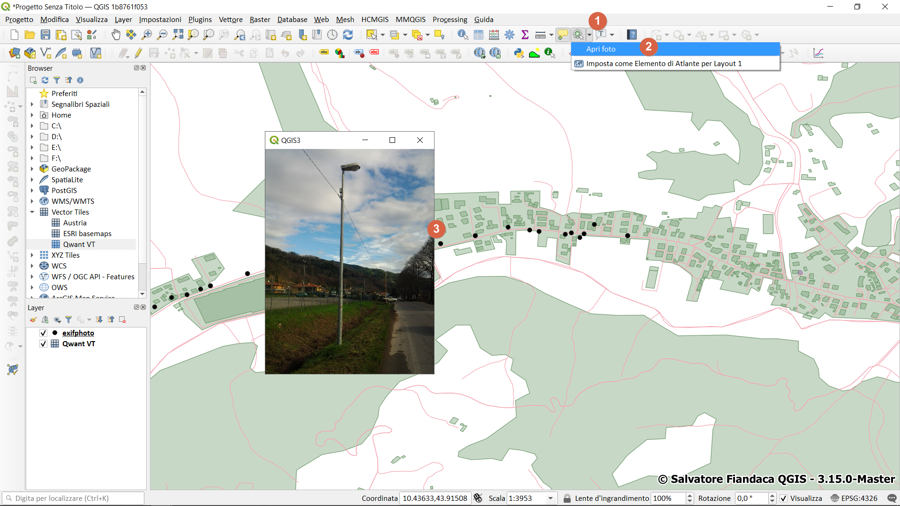
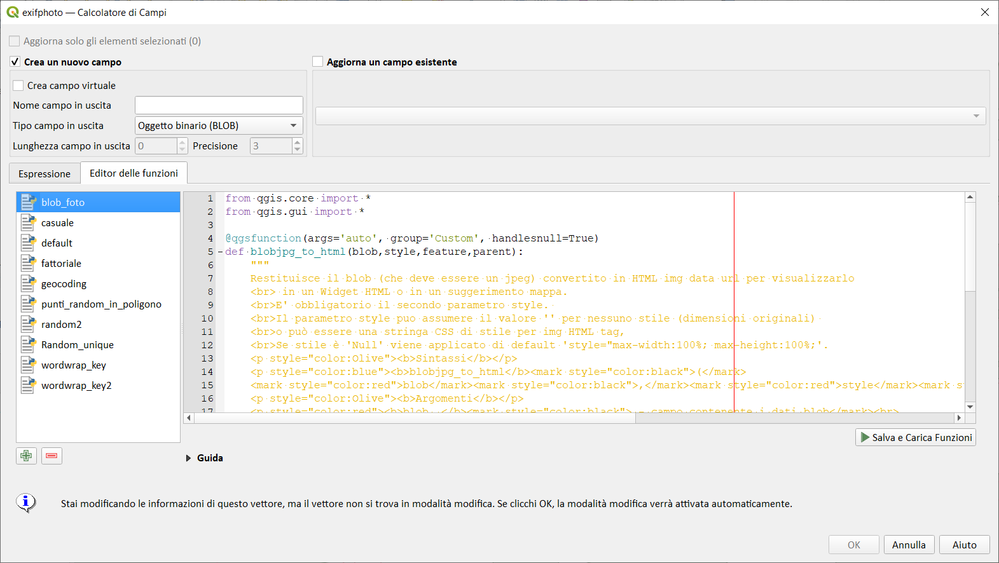
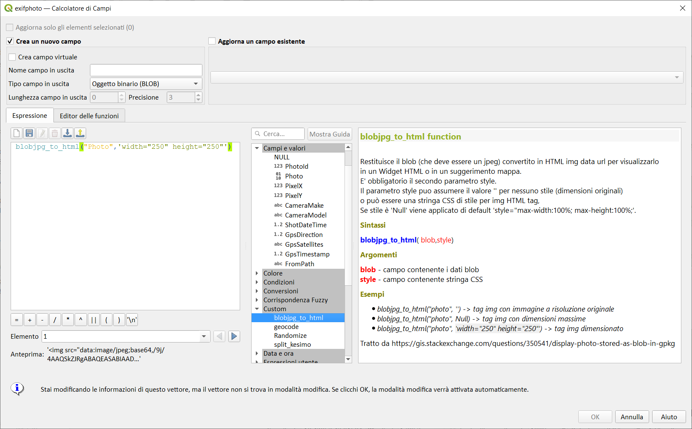
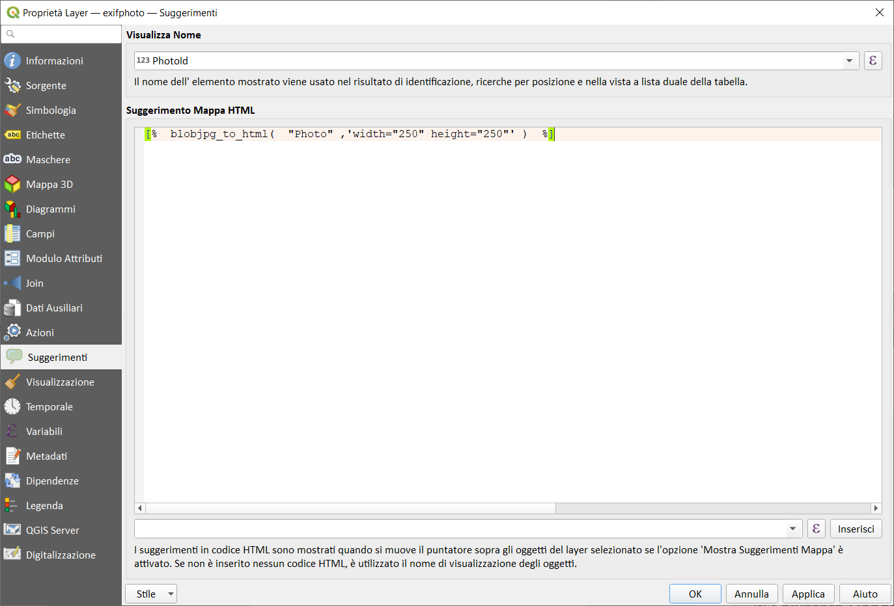
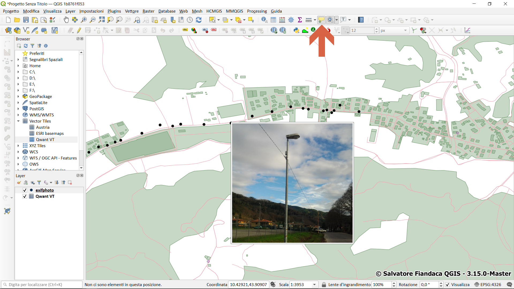
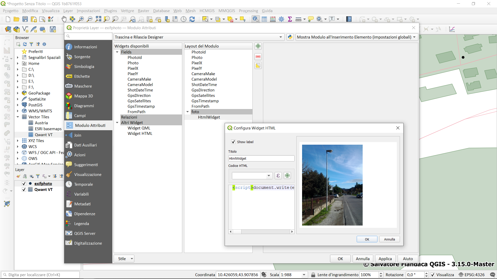
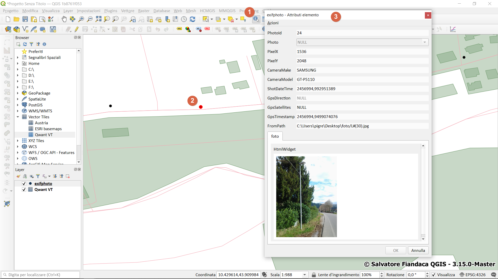
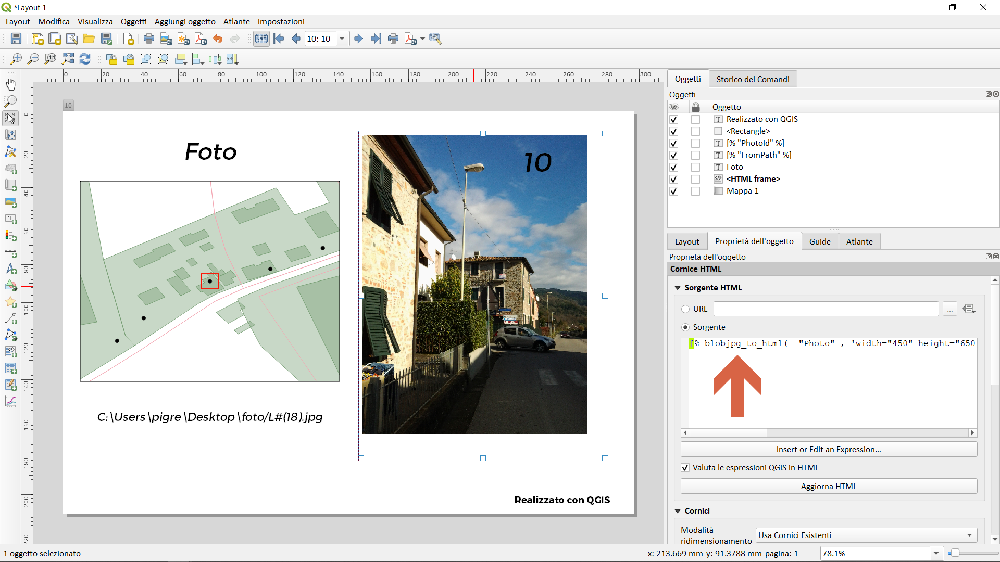

# BlobImageSL

Visualizzazione di Blob Image con SpatiaLite e QGIS / Visualization of Blob Image with SpatiaLite and QGIS

<!-- TOC -->

- [BlobImageSL](#blobimagesl)
  - [Perché questo repository](#perché-questo-repository)
  - [Script](#script)
    - [Script azione Python](#script-azione-python)
    - [Funzione custom per field calc](#funzione-custom-per-field-calc)
    - [Espressione per widget HTML](#espressione-per-widget-html)
    - [Corniche HTML per Atlas](#corniche-html-per-atlas)
  - [Riferimenti](#riferimenti)
  - [Screenshot](#screenshot)
    - [Azione](#azione)
    - [Map tips](#map-tips)
    - [Widget HTML per modulo](#widget-html-per-modulo)
    - [Atlas](#atlas)

<!-- /TOC -->

## Perché questo repository

Il repository nasce dopo tre anni da [questo mio](https://pigrecoinfinito.com/2017/06/18/qgis-visualizzare-blob-image-spatialite/) blog post su Pigrecoinfinito in cui descrivo come visualizzare delle foto, con geotag, a partire da un database SpatiaLite: database realizzato utilizzando `ImportEXIFphotos` che trasforma le foto in formato `BLOB`.

Il repository vuole documentare tutti i passaggi e gli script necessari per poter utilizzare le foto (con geotag) e i metadati direttamente in QGIS, per esempio visualizzazione delle foto tramite _azione Python_, _suggerimenti mappa_, _moduli tramite widget_ e _compositore di stampe_.

## Script

### Script azione Python


Alla riga 7 sostituire il valore unique_field_name con il nome di un campo univoco (magari la chiave primaria), la riga 8 deve contenere il nome del campo dove sono state memorizzate le foto ed infine alla riga 9 va messo lo stesso valore come alla riga 5 lasciando in questo caso la stringa ‘[% %]’.

```python
from qgis.PyQt.QtCore import Qt
from qgis.PyQt.QtWidgets import QLabel
from qgis.PyQt.QtGui import QImage, QPixmap
from qgis.utils import iface
import sqlite3

UNIQUE_FIELD = "unique_field_name"
BLOB_FIELD = "picture_field_name"
FIELD_VALUE = '[%unique_field_name%]'

vl = iface.activeLayer()
pr = vl.dataProvider()
db = pr.dataSourceUri().split(' ')[0].replace('dbname=','').replace("'","")
conn = sqlite3.connect(db)
sql = "SELECT {0} FROM {1} WHERE {2}={3}".format(BLOB_FIELD, vl.name(), 
                                                 UNIQUE_FIELD, FIELD_VALUE)
c = conn.cursor()
c.execute(sql)
rows = c.fetchone()
c.close()
conn.close()

qimg = QImage.fromData(rows[0])
pixmap = QPixmap.fromImage(qimg)

label = QLabel()
h = label.height()
w = label.width()
label.setPixmap(pixmap.scaled(w,h,Qt.KeepAspectRatio))
label.show()
```

- **Autore**: Salvatore Larosa
- **Articolo**: https://slarosagis.wordpress.com/2017/06/18/mai-visto-una-blob-image-da-qgis/

↑[torna su](#blobimagesl)↑

### Funzione custom per field calc

Utilizzato per i suggerimenti mappa (visualizzare la foto con il passaggio del mouse)

```python
from qgis.core import *
from qgis.gui import *

@qgsfunction(args='auto', group='Custom', handlesnull=True)
def blobjpg_to_html(blob,style,feature,parent):
    """
    Restituisce il blob (che deve essere un jpeg) convertito in HTML img data url per visualizzarlo
    <br> in un Widget HTML o in un suggerimento mappa.
    <br>E' obbligatorio il secondo parametro style. 
    <br>Il parametro style puo assumere il valore '' per nessuno stile (dimensioni originali) 
    <br>o può essere una stringa CSS di stile per img HTML tag,
    <br>Se stile è 'Null' viene applicato di default 'style="max-width:100%; max-height:100%;'.
    <p style="color:Olive"><b>Sintassi</b></p>
    <p style="color:blue"><b>blobjpg_to_html</b><mark style="color:black">(</mark>
    <mark style="color:red">blob</mark><mark style="color:black">,</mark><mark style="color:red">style</mark><mark style="color:black">)</mark>
    <p style="color:Olive"><b>Argomenti</b></p>
    <p style="color:red"><b>blob  </b><mark style="color:black"> - campo contenente i dati blob</mark><br>
    <mark style="color:red"><b>style </b><mark style="color:black"> - campo contenente stringa CSS</mark>
    <p style="color:Olive"><b>Esempi</b></p>
        <ul>
            <li><mark><i> blobjpg_to_html("photo", '') -> tag img con immagine a risoluzione originale</mark></li>
            <li><mark><i> blobjpg_to_html("photo", Null) -> tag img con dimensioni massime </mark></li>
            <li><mark><i> blobjpg_to_html("photo", 'width="250" height="250"')   -> tag img dimensionato</mark></li>
        </ul>
    
    Tratto da https://gis.stackexchange.com/questions/350541/display-photo-stored-as-blob-in-gpkg
    """
    blob64 = blob.toBase64().data().decode()
    if style is None:
        stylestring = 'style="max-width:100%; max-height:100%;"'
    elif not(style):
        stylestring = 'style=""'
    else:
        stylestring = 'style="' + style + '"'
    fullstring = ''
    return fullstring
```

- **Autore**: Giulio Fattori

### Espressione per widget HTML

```html
<script>document.write(expression.evaluate(" blobjpg_to_html( \"photo\",'width=\"300\" height=\"420\"')"));</script>
``` 

- **Autore**: Giulio Fattori

### Corniche HTML per Atlas

```
[% blobjpg_to_html("Photo",'width="450" height="650"') %]
```

↑[torna su](#blobimagesl)↑

- **Autore**: Giulio Fattori

## Riferimenti

- **blog post di Totò Fiandaca** : <https://pigrecoinfinito.com/2017/06/18/qgis-visualizzare-blob-image-spatialite/>
- **blog post di Salvatore Larosa** : <https://slarosagis.wordpress.com/2017/06/18/mai-visto-una-blob-image-da-qgis/>
- **gis.stackexchange**: <https://gis.stackexchange.com/questions/350541/display-photo-stored-as-blob-in-gpkg>

↑[torna su](#blobimagesl)↑

## Screenshot

### Azione





↑[torna su](#blobimagesl)↑

### Map tips









↑[torna su](#blobimagesl)↑

### Widget HTML per modulo





↑[torna su](#blobimagesl)↑

### Atlas



↑[torna su](#blobimagesl)↑